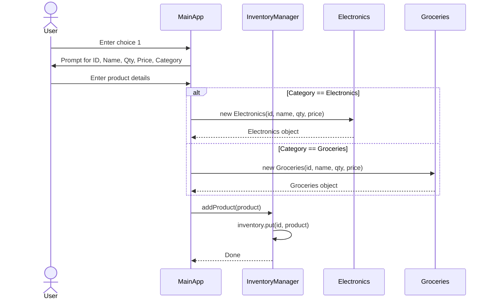
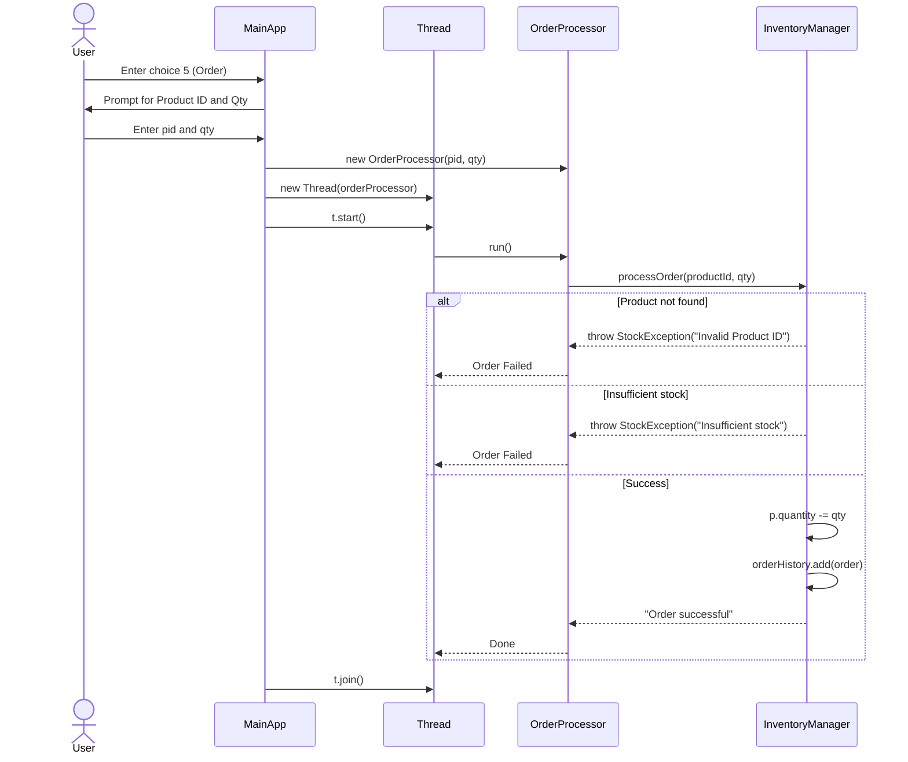
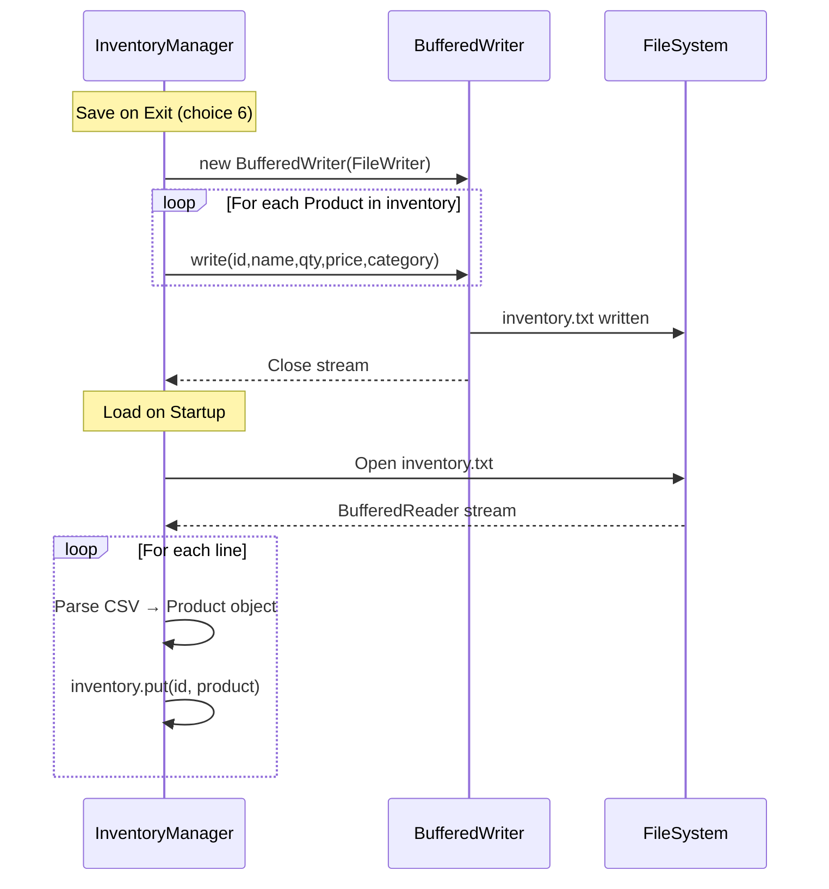

# 🔧 Technical Documentation — Java Inventory Management System

---

## 1. Class Diagram

```
┌─────────────────────────────────────────────────────────────────────┐
│                        CLASS DIAGRAM                                │
│                  Inventory Management System                        │
└─────────────────────────────────────────────────────────────────────┘

         ┌──────────────────────────────────┐
         │            <<class>>             │
         │             Product              │
         ├──────────────────────────────────┤
         │  # id         : int              │
         │  # name       : String           │
         │  # quantity   : int              │
         │  # price      : double           │
         │  # category   : String           │
         ├──────────────────────────────────┤
         │  + display() : void              │
         └──────────────┬───────────────────┘
                        │
          extends       │       extends
         ┌──────────────┴───────────────────┐
         │                                  │
         ▼                                  ▼
┌─────────────────────┐          ┌─────────────────────┐
│      <<class>>      │          │      <<class>>      │
│     Electronics     │          │      Groceries      │
├─────────────────────┤          ├─────────────────────┤
│                     │          │                     │
├─────────────────────┤          ├─────────────────────┤
│ + Electronics(      │          │ + Groceries(        │
│     id, name,       │          │     id, name,       │
│     qty, price)     │          │     qty, price)     │
└─────────────────────┘          └─────────────────────┘


         ┌──────────────────────────────────┐
         │            <<class>>             │
         │         InventoryManager         │
         ├──────────────────────────────────┤
         │  - inventory    : Map<Int,Prod>  │
         │  - orderHistory : List<String>   │
         ├──────────────────────────────────┤
         │  + addProduct(p) : void          │
         │  + displayProducts() : void      │
         │  + searchProduct(kw) : void      │
         │  + filterByCategory(c) : void    │
         │  + processOrder(id,qty) : void   │──────── throws ────────►
         │  + saveToFile() : void           │
         │  + loadFromFile() : void         │
         └──────────────┬───────────────────┘
                        │
                        │ contains (inner class)
                        │
                        ▼
         ┌ ─ ─ ─ ─ ─ ─ ─ ─ ─ ─ ─ ─ ─ ─ ─ ┐
              <<inner class / Runnable>>
         │          OrderProcessor          │
          ─ ─ ─ ─ ─ ─ ─ ─ ─ ─ ─ ─ ─ ─ ─ ─
         │  - productId : int               │
         │  - qty       : int               │
          ─ ─ ─ ─ ─ ─ ─ ─ ─ ─ ─ ─ ─ ─ ─ ─
         │  + run() : void                  │
         └ ─ ─ ─ ─ ─ ─ ─ ─ ─ ─ ─ ─ ─ ─ ─ ┘


         ┌──────────────────────────────────┐
         │           <<exception>>          │
         │          StockException          │
         ├──────────────────────────────────┤
         │  extends Exception               │
         ├──────────────────────────────────┤
         │  + StockException(msg)           │
         └──────────────────────────────────┘


RELATIONSHIPS
─────────────────────────────────────────────────────────────────────
  Electronics      ── extends ──────────────────────────►  Product
  Groceries        ── extends ──────────────────────────►  Product
  InventoryManager ── manages ─────────────────────────►  Product
  InventoryManager ── contains (inner) ────────────────►  OrderProcessor
  InventoryManager ── throws ──────────────────────────►  StockException
  OrderProcessor   ── calls ───────────────────────────►  processOrder()
  MainApp          ── uses ────────────────────────────►  InventoryManager


ACCESS MODIFIERS
─────────────────────────────────────────────────────────────────────
  +  public       #  protected       -  private
```

---

## 2. Sequence Diagrams

### 2a. Add Product Flow



### 2b. Order Processing Flow (Multithreaded)



### 2c. Save and Load File Flow



---

## 3. Key Design Decisions

| Concept | Implementation |
|---|---|
| **Inheritance** | `Electronics` and `Groceries` extend `Product` |
| **Encapsulation** | `inventory` and `orderHistory` are `private` in `InventoryManager` |
| **Custom Exception** | `StockException` extends `Exception` for stock validation |
| **Multithreading** | `OrderProcessor` implements `Runnable`; runs as a separate `Thread` |
| **Thread Safety** | `processOrder()` is `synchronized` to prevent race conditions |
| **File I/O** | `BufferedWriter`/`BufferedReader` for efficient read/write |
| **Collections** | `HashMap` for O(1) product lookup; `ArrayList` for order history |

---

## 4. Exception Handling

| Exception | When Thrown | Handled By |
|---|---|---|
| `StockException("Invalid Product ID")` | Product ID not in inventory | `OrderProcessor.run()` |
| `StockException("Insufficient stock")` | Requested qty > available qty | `OrderProcessor.run()` |
| `IOException` | File not found or unreadable | `saveToFile()` / `loadFromFile()` |
| `InterruptedException` | Thread join interrupted | `main()` catch block |

---

## 5. File Format

Inventory is stored as comma-separated values in `inventory.txt`:

```
101,Laptop,10,45000.0,Electronics
102,Rice,50,60.5,Groceries
103,Phone,5,15000.0,Electronics
```

Format: `id,name,quantity,price,category`
